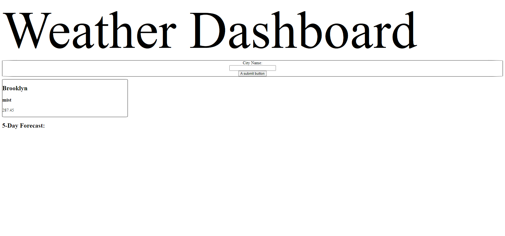

# weatherForecastChal

As a user, I wanted to be able to search a city and get an accurate weather forecast. I was able to complete this by utilizing the open weather API and storing user input values in local storage. I was also able to make a card using the data received from our API and append it to the DOM Element. However, I was unable to create a for loop that would run this function to create a 5 day forecast.

